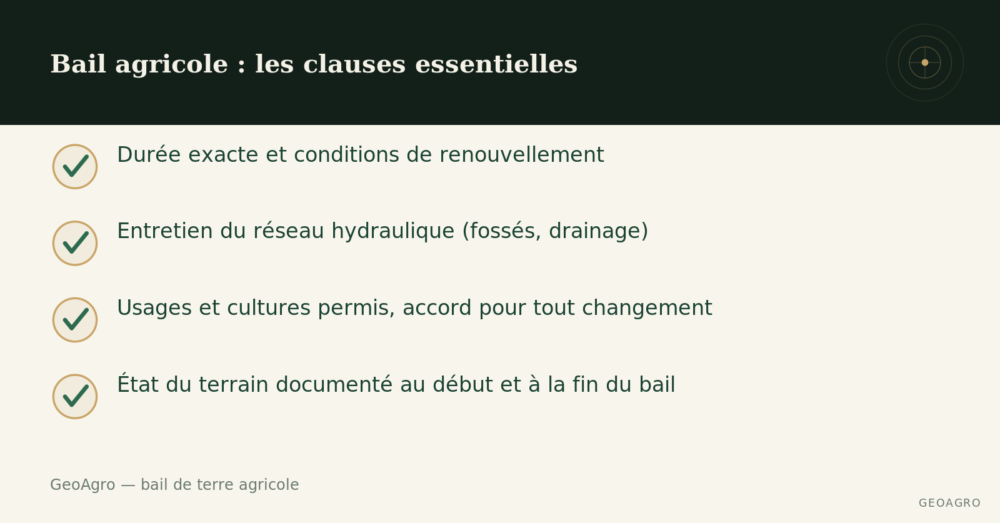

## Un bail verbal ne protège personne

Louer une terre agricole se fait encore souvent sur une poignée de main, entre voisins ou connaissances de longue date. Ça fonctionne bien tant que la relation reste cordiale — et ça devient un problème dès qu'un désaccord survient sur l'entretien, le renouvellement, ou l'état du champ à la fin du bail. Un bail écrit, même simple, évite la majorité de ces situations.

## La durée et les conditions de renouvellement

Un bail agricole devrait préciser sa durée exacte et les conditions de renouvellement — reconduction automatique ou non, préavis requis, ajustement possible du loyer à chaque renouvellement. Sans cette clarté, un locataire peut investir dans l'amélioration d'un champ sans garantie de pouvoir en profiter au-delà d'une saison, ce qui décourage tout entretien à long terme.

## L'entretien du réseau hydraulique

Qui est responsable de l'entretien du réseau hydraulique — nettoyage des fossés, entretien du drainage souterrain existant — pendant la durée du bail? Cette question, souvent oubliée, détermine si l'excès d'eau qui apparaît en cours de bail sera corrigé rapidement ou laissé de côté, faute de savoir qui doit s'en occuper.

## Les usages permis et les limites

Le bail devrait préciser les cultures ou usages permis, et si des changements de pratique (nouvelle rotation, ajout de drainage, chaulage) nécessitent l'accord préalable du bailleur. Ça évite les malentendus sur ce qui relève de la gestion normale du locataire et ce qui constitue une modification substantielle du terrain.

## L'état du terrain au début et à la fin du bail

Documenter l'état du champ avant l'entrée en bail — et prévoir la même documentation à la fin — protège les deux parties. Ça évite qu'un désaccord sur la dégradation ou l'amélioration du terrain ne se règle uniquement à partir de souvenirs, des années plus tard. [Cet article](../etat-terrain-avant-bail/index.qmd) explique pourquoi cette étape profite autant au bailleur qu'au locataire.

## Un contrat court, mais complet

Un bail agricole n'a pas besoin d'être long pour être solide. Il doit simplement couvrir ces éléments clairement, avant la signature, plutôt que de s'en remettre à la bonne entente du moment.

------------------------------------------------------------------------

*Ce contenu est informatif et général — chaque terrain mérite une évaluation propre à sa situation.*
