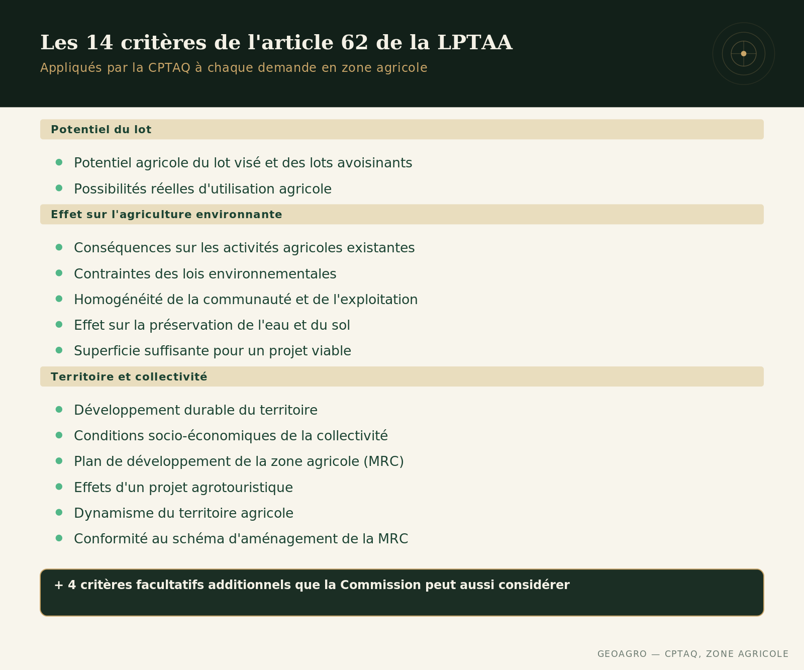

## Une terre en zone verte, ce n'est pas un mur

Beaucoup de gens qui regardent une terre en zone agricole se demandent ce qu'ils pourront réellement en faire au-delà de l'exploitation actuelle : morceler, construire, changer l'usage. La réponse ne dépend pas d'une appréciation improvisée, au cas par cas. La Loi sur la protection du territoire et des activités agricoles (LPTAA) fixe une liste précise de critères, et la Commission de protection du territoire agricole du Québec (CPTAQ) les applique à chaque demande d'autorisation, de morcellement ou d'aliénation en zone verte.

## D'où viennent ces critères

Ce ne sont pas des impressions laissées à la discrétion d'un commissaire. L'article 62 de la LPTAA énumère 14 critères obligatoires que la CPTAQ doit considérer pour toute demande touchant une terre agricole, en plus de 4 critères facultatifs qu'elle peut prendre en compte. Un guide publié conjointement par la CPTAQ et l'Ordre des agronomes du Québec traduit ces critères légaux en éléments concrets, observables sur le terrain — ce qui rend l'exercice prévisible pour quiconque prend le temps de s'y référer avant de déposer une demande.

## Le potentiel agricole du lot, avant tout

Les deux premiers critères regardent d'abord ce que la terre peut produire, pas ce que le demandeur souhaite en faire. La CPTAQ évalue le potentiel agricole du lot visé et des lots avoisinants, ainsi que les possibilités réelles d'utiliser cette terre à des fins agricoles. Un lot isolé, de faible potentiel, entouré de terres déjà peu propices à la culture, n'est pas traité de la même façon qu'un lot au cœur d'un secteur agricole homogène et productif. Le contexte du voisinage pèse autant que la parcelle elle-même.

## L'effet sur l'agriculture environnante et les ressources

Plusieurs critères élargissent ensuite le regard au-delà du lot visé : les conséquences sur les activités agricoles existantes et sur les possibilités d'utilisation agricole des lots avoisinants, les contraintes découlant des lois environnementales (notamment pour les établissements d'élevage), l'homogénéité de la communauté et de l'exploitation agricole, ainsi que l'effet sur la préservation de l'eau et du sol pour l'agriculture dans la région. La Commission regarde aussi si les propriétés résultantes ont une superficie suffisante pour un projet agricole viable, selon une diversité de modèles.

## Le développement du territoire et de la collectivité

D'autres critères regardent le contexte plus large : l'effet sur le développement durable du territoire, les conditions socio-économiques nécessaires à la vitalité d'une collectivité lorsque celle-ci est faible, le plan de développement de la zone agricole de la MRC, les effets d'un projet agrotouristique sur la viabilité de l'exploitation, le dynamisme du territoire agricole, et la conformité au schéma d'aménagement de la MRC. Ensemble, ces critères font en sorte qu'une décision sur un lot précis tient aussi compte de ce qu'elle signifie pour l'agriculture de la région dans son ensemble.

## Ce que ça change pour un acheteur

Ces 14 critères sont toujours les mêmes, peu importe la demande. Ce n'est pas un jugement d'ensemble ni une évaluation à géométrie variable — c'est une grille fixe, appliquée de façon constante, la Commission retenant les critères pertinents selon chaque dossier. Pour un acheteur, les connaître avant de faire une offre permet de mieux lire ce qu'une terre en zone verte permet vraiment, et ce qui reste hors de portée sans passer par une demande d'autorisation formelle.

Deux nuances valent la peine d'être approfondies séparément : ce que [les droits acquis](../droits-acquis-zone-agricole/index.qmd) protègent réellement, et ce que [la lecture de décisions réelles de la CPTAQ](../133-decisions-cptaq/index.qmd) révèle sur ce qui distingue un dossier accepté d'un dossier refusé.

------------------------------------------------------------------------

*Ce contenu est informatif et général — chaque terrain mérite une évaluation propre à sa situation.*
