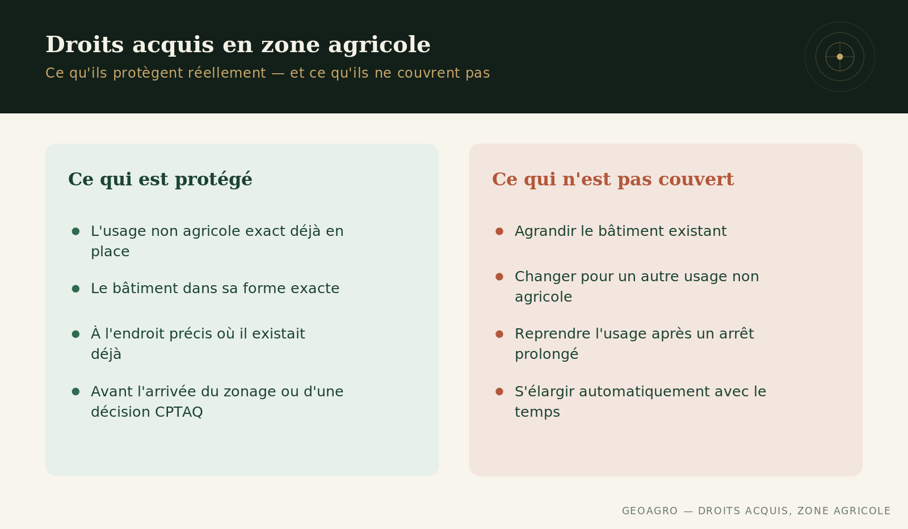

## Un droit acquis, ce n'est pas un passe-droit

L'expression revient souvent dans une visite ou une annonce : « il y a des droits acquis sur ce lot ». Elle est parfois utilisée comme si elle réglait toutes les questions d'usage sur une terre en zone agricole. En réalité, un droit acquis est beaucoup plus étroit que ce que l'expression laisse croire — et savoir précisément ce qu'il couvre évite de mauvaises surprises après l'achat. C'est une nuance distincte des [14 critères que la CPTAQ applique](../cptaq-zone-agricole/index.qmd) pour autoriser un usage non agricole en zone verte.

## Ce qu'un droit acquis protège vraiment

Un droit acquis reconnaît un usage non agricole ou un bâtiment qui existait déjà avant que le zonage agricole, ou une décision précise de la CPTAQ, ne vienne l'encadrer. Il protège cet usage exact, dans sa forme exacte, à cet endroit précis — pas un droit général à faire ce qu'on veut du lot par la suite. Deux terrains voisins peuvent avoir un historique différent, et donc des droits acquis qui ne se ressemblent pas du tout.

## Ce qu'il ne couvre pas

Agrandir un bâtiment existant, changer un usage pour un autre usage non agricole, ou reprendre une activité après un arrêt prolongé ne sont généralement pas couverts par le droit acquis d'origine. Ces situations exigent le plus souvent une démarche distincte auprès de la CPTAQ, même si l'usage initial, lui, était parfaitement légitime. Un droit acquis ne s'élargit pas avec le temps ni avec un changement de propriétaire.

## Ce qui se vérifie, pas ce qui se suppose

Un droit acquis ne se transmet pas automatiquement « en confiance » au nouvel acheteur : sa validité repose sur une preuve d'usage continu, souvent documentée (photos aériennes historiques, permis, évaluations municipales successives). Avant de considérer un usage comme acquis, il vaut la peine de demander au vendeur ou au notaire quelles preuves existent, plutôt que de se fier à une affirmation transmise d'un propriétaire à l'autre depuis des décennies.

## Une nuance qui change une offre

Un acheteur qui prévoit maintenir, agrandir, ou reprendre un usage particulier sur une terre en zone agricole a intérêt à comprendre cette distinction avant de signer, pas après. Ce que la loi protège est précis. Ce que l'usage et les habitudes locales laissent croire l'est parfois beaucoup moins.

------------------------------------------------------------------------

*Ce contenu est informatif et général — chaque terrain mérite une évaluation propre à sa situation.*
