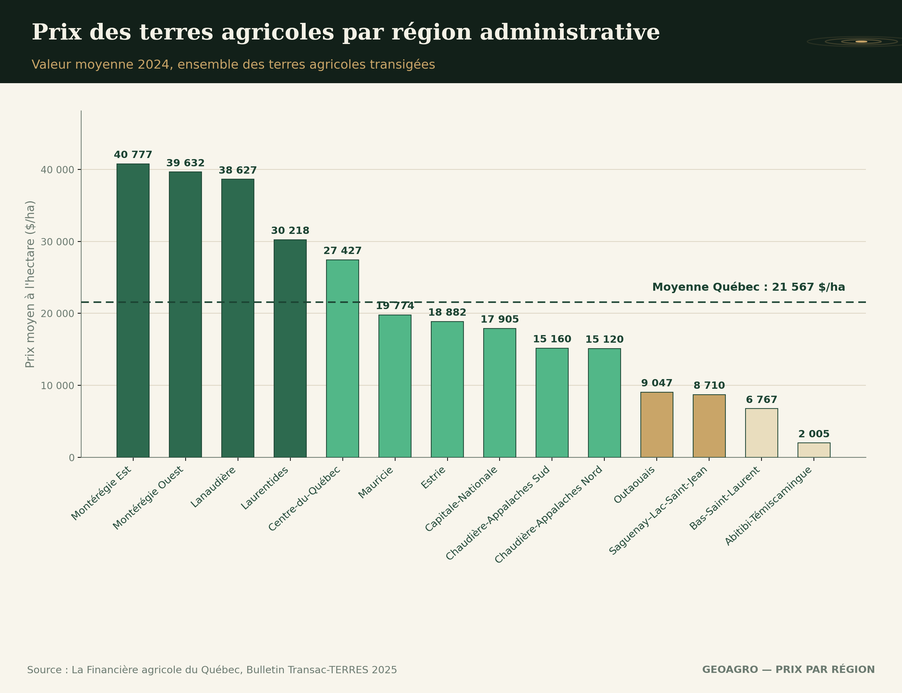

## Même superficie, prix très différent

Une terre de 40 hectares en Montérégie ne se vend généralement pas au même prix qu'une terre de superficie comparable dans une région plus périphérique. La différence ne s'explique pas seulement par la localisation en soi — plusieurs facteurs concrets, souvent peu visibles pour un acheteur qui compare des régions pour la première fois, expliquent ces écarts. [Les données Transac-TERRES](../prix-terres-transac-terres/index.qmd) permettent de suivre ces écarts dans le temps, mais elles ne remplacent pas ce contexte régional.

## La qualité et l'homogénéité du sol

Certaines régions du Québec regroupent des sols de meilleure classe agricole, plus homogènes sur de grandes superficies, avec moins de zones de mauvais rendement dispersées dans un même lot. Une terre dans une région reconnue pour la qualité constante de son sol se négocie presque toujours à prix supérieur, indépendamment de la superficie elle-même.

## La proximité des infrastructures de transformation

La distance jusqu'aux acheteurs de récolte, aux installations de transformation, ou aux réseaux de distribution influence directement la valeur d'une terre. Une région où les infrastructures agroalimentaires sont concentrées réduit les coûts de transport et de logistique pour l'exploitant, ce qui se reflète dans le prix que les acheteurs sont prêts à payer.

## La pression de la demande non agricole

Dans certains secteurs, la proximité des centres urbains ou l'attrait résidentiel exerce une pression à la hausse sur le prix des terres agricoles, même lorsque leur potentiel agronomique reste comparable à celui d'une région plus éloignée. Cette pression n'a rien à voir avec la capacité productive du sol — elle reflète une demande parallèle, souvent pour un usage éventuellement différent de l'agriculture.

## L'historique d'investissement en drainage

Une région où le drainage souterrain a été installé et entretenu de façon plus systématique au fil des décennies présente généralement des terres plus homogènes en capacité de rendement, ce qui réduit le risque perçu par un acheteur et soutient le prix. À l'inverse, une région où l'investissement en drainage est plus inégal peut afficher des prix moyens plus bas, mais avec une variabilité plus grande d'une parcelle à l'autre.

## Comparer une région, pas seulement un prix

Comparer deux régions uniquement sur la base du prix au hectare passe à côté de l'essentiel. Le sol, les infrastructures, la pression du marché et l'historique de drainage expliquent ensemble pourquoi deux terres, à première vue similaires, ne se négocient jamais tout à fait de la même façon.

------------------------------------------------------------------------

*Ce contenu est informatif et général — chaque terrain mérite une évaluation propre à sa situation.*
