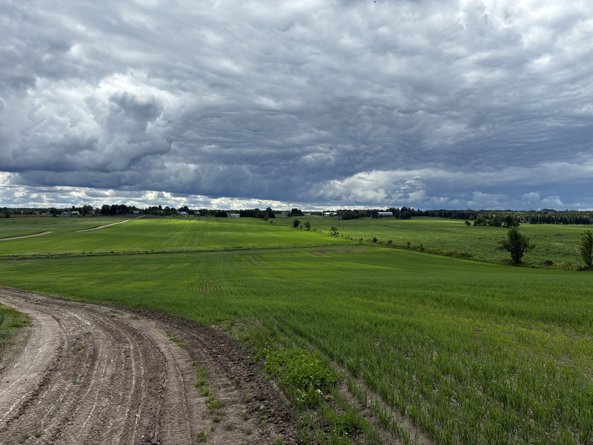

## Connaître une terre depuis toujours n'est pas la connaître vraiment

Reprendre la terre familiale se fait souvent sans les mêmes réflexes de vérification qu'un achat auprès d'un étranger. La relève a grandi sur ce terrain, en connaît les recoins, les habitudes de culture, les histoires racontées d'une génération à l'autre. Cette familiarité rassure, mais elle ne remplace pas certaines questions agronomiques précises — surtout quand la dernière décennie d'exploitation n'a pas été documentée de la même façon qu'une transaction entre parties non liées.

## Ce que les dernières années ont pu changer

Un parent qui a ralenti son rythme d'exploitation dans les dernières années avant un transfert a pu, sans le vouloir, laisser certaines zones du champ se dégrader tranquillement — un entretien du réseau hydraulique moins fréquent, une rotation simplifiée, un chaulage retardé. Ces changements graduels passent souvent inaperçus dans une famille, précisément parce que personne ne les documente activement d'année en année.

## L'âge réel du réseau de drainage

Un système de drainage souterrain installé plusieurs décennies plus tôt peut approcher la fin de sa durée de vie utile sans que la famille en ait une idée précise, faute de documentation technique conservée. Vérifier l'âge du réseau hydraulique existant, et si des travaux de rabattement ont déjà été nécessaires, évite d'hériter d'un problème qui n'était simplement pas visible tant que le rythme d'exploitation restait stable.

## Les usages et droits qui n'ont jamais été formalisés

Une terre familiale porte parfois des usages qui se sont installés par habitude plutôt que par démarche officielle — un accès, un usage secondaire, un arrangement avec un voisin. Ce qui semblait aller de soi au sein de la famille peut ne pas être formalisé du tout, et mérite d'être clarifié avant un transfert, plutôt que d'être simplement reconduit sur la base de la mémoire familiale.

## Poser les questions, même en famille

Poser ces questions dans un contexte familial peut sembler inutile, voire délicat. C'est pourtant le moment le plus simple pour le faire : les réponses sont encore accessibles, la personne qui connaît l'historique est encore présente pour y répondre, et une transition bien documentée protège autant la relève que la génération qui transmet. La [liste des questions à poser avant de signer une offre](../questions-avant-signer/index.qmd) sur une terre agricole s'applique tout autant à une reprise familiale. Du côté du financement, [les programmes de relève comme FIRA et la LCPA](../financement-releve-fira-lcpa/index.qmd) méritent aussi d'être vérifiés tôt dans le processus.

------------------------------------------------------------------------

*Ce contenu est informatif et général — chaque terrain mérite une évaluation propre à sa situation.*
