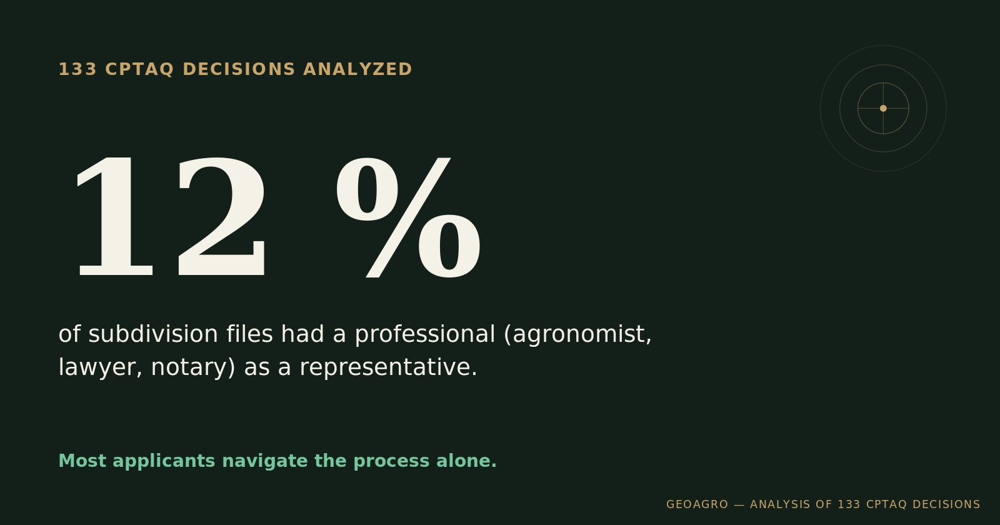

## A simple question, rarely answered directly

What actually tips a CPTAQ decision one way or the other? The law lists the criteria, but it doesn't say which ones carry the most weight in practice, or what separates a well-built file from one that misses the mark. Rather than go on general impression, I read 133 decisions, mostly land subdivision cases, across four Quebec MRCs.

## The number that surprised me most

In this sample, **only 12% of subdivision files had a professional (agronomist, lawyer, notary) named as a representative on the file**. The vast majority of applicants, often individuals or small businesses, go through the process alone, without technical or legal support.

## What shows up in approved files

Three elements come up consistently in favourable decisions: a demonstration that the resulting lot size supports a viable agricultural project, consistency with the size of neighbouring properties (homogeneity), and economic proof of the project, not just a stated intention. That last point is the most decisive, and the least often done well.

## A contrast that illustrates the pattern

Two files, same type of application, opposite outcomes. One was rejected partly because the applicant had submitted neither a detailed project nor supporting financial documentation for the subdivision. The other was approved, backed by a costed project, despite open questions about its financing. The difference wasn't the quality of the land — it was the rigour of the evidence filed. [This specific case](../viabilite-economique-morcellement/index.qmd) walks through that contrast in detail.

## What this means in practice

Having the right criteria show up in a file isn't enough — they appear in similar proportions whether a file is approved or rejected. It's the **quantified, comparative evidence** that makes the difference: a projected yield, a regional benchmark, a measurable data point rather than a general statement. That's precisely the blind spot most files in my sample never filled.

That finding is what led to launching a [full-service mandate for subdivision files](../lancement-service-mandataire/index.qmd).

------------------------------------------------------------------------

*Analysis based on a sample of 133 decisions rendered in four MRCs (Chaudière-Appalaches and Montérégie), mostly subdivision cases. Every file deserves an assessment suited to its own situation.*
