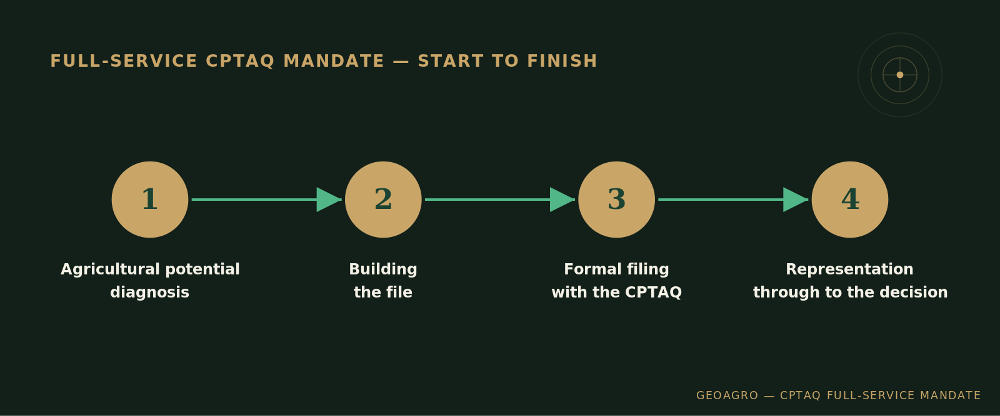

<!-- DO NOT PUBLISH BEFORE COMPLETING THE LPTAA TRAINING (Cécile Demers, November 2026). This post announces the mandataire (full-service representation) offering, which is neither offered nor mentioned publicly before that date. -->

## A year of preparation, a new offering

For the past few months, GeoAgro has been helping landowners, developers, notaries, and municipalities with agricultural potential diagnostics for their CPTAQ files. That service continues unchanged. A second offering is now added: full support for a subdivision file, from diagnosis through to the Commission's decision.

## Why this service, and why now

In an [analysis of over a hundred CPTAQ decisions](../133-decisions-cptaq/index.qmd), a clear pattern emerged: most subdivision files are prepared without any professional, technical, or legal support. Many landowners and farmers navigate a process on their own that nonetheless demands rigorous evidence to succeed. This new service responds directly to that gap, backed by completed training on the concrete steps of a CPTAQ application, on top of the agronomic expertise already in place.

## What this service covers

The agricultural potential diagnosis, preparation and formal filing of the application, acting as the point of contact with the Commission throughout the file's review, and representation in exchanges with the Commission through to the decision.

## What it doesn't cover

Criteria that fall under other areas of expertise, such as municipal zoning compliance or the availability of alternative sites outside the agricultural zone, remain outside the scope of this service, and continue to be handled by the planner or notary on file, as applicable.

## Who this is for

Landowners and farmers who'd rather hand off the whole process to someone they trust, instead of managing exchanges with the Commission themselves.

------------------------------------------------------------------------

*To discuss a specific file, get in touch directly.*
