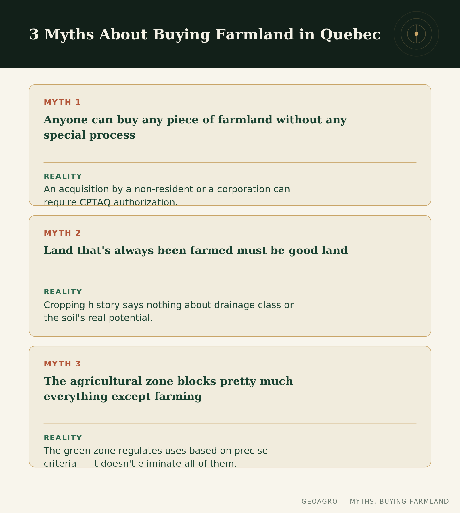

## Assumptions that get expensive

A handful of ideas about buying farmland in Quebec keep getting repeated from one buyer to the next, without ever really being checked. Three of them come up especially often — and each can lead to an unpleasant surprise if it isn't corrected before an offer is made.

## Myth 1: "Anyone can buy any piece of farmland without any special process"

Not always true. An acquisition by a non-resident individual or by a corporation can require CPTAQ authorization under Quebec's Act respecting the acquisition of farmland by non-residents. Agricultural zoning doesn't block the transaction itself in most cases between resident individuals, but certain buyer profiles need to check their eligibility before committing, not after.

## Myth 2: "Land that's always been farmed must be good land"

A field's cropping history says nothing about its drainage class or its real agricultural potential. A field can be cultivated year after year despite a chronically disappointing yield in certain sections — producers adapt, work around low spots, adjust their expectations without necessarily fixing the underlying problem. The fact that a piece of land has always carried a crop doesn't guarantee it's performing anywhere near its full potential. That's exactly the distinction between [farmed land and farmland potential](../terre-culture-vs-potentiel/index.qmd) that explains why two farms at the same price can hide very different realities.

## Myth 3: "The agricultural zone blocks pretty much everything except farming"

This is a common exaggeration. The green zone regulates uses; it doesn't eliminate all of them. A precise set of legal criteria determines what can be authorized beyond ordinary farming — [this article](../cptaq-zone-agricole/index.qmd) explains how the CPTAQ actually applies them. The reality sits between the two extremes: neither a total wall, nor an unregulated space.

## Verify, don't repeat

These three myths share something: they flatten a reality that deserves to be checked case by case, not assumed out of habit. A question asked directly — to a notary, a broker, or the public registries — costs far less than a wrong assumption discovered after the signature.

------------------------------------------------------------------------

*This content is general and informational — every property deserves an assessment suited to its own situation.*
