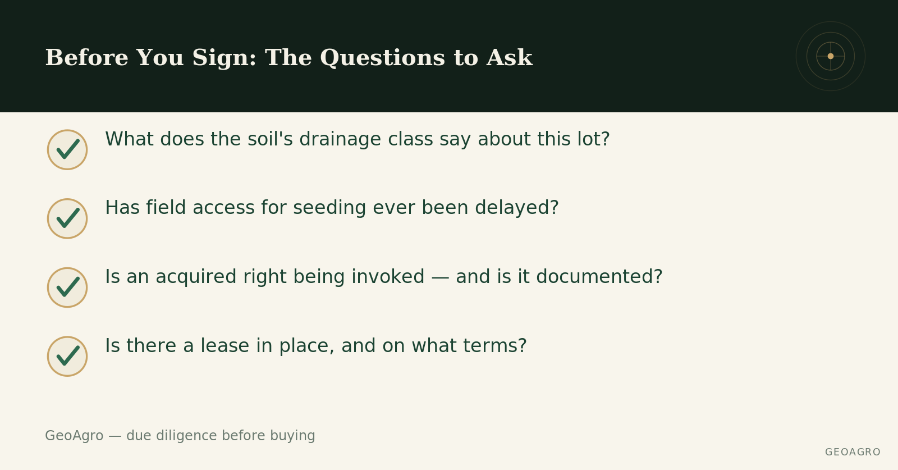

## A one-hour visit won't show you everything

Many buyers approach farmland with the same reflexes as a residential purchase: check the title, walk the buildings, look at general condition. Soil and water don't reveal themselves that way. A field can look flawless in mid-summer and still hide a problem that only shows up at thaw, or a legal status more limited than it first appears. Here are the questions worth asking before signing an offer on agricultural land.

## Soil and water, first

The central question: what does the soil's drainage class actually say about this lot? In Quebec, IRDA's soil survey data is public and already tells you which hydrological group a parcel belongs to, before any site visit. It's worth asking the seller or broker whether a recent soil test exists, and whether any part of the field is known for spring waterlogging or a yield that consistently lags behind the rest of the parcel. [These hidden drainage signs](../signes-drainage-cache/index.qmd) are often visible on a simple walk-through, before any lab test.

## The field's history of use

Which crops were grown in recent years, what rotation was followed, and — most tellingly — has field access for seeding been repeatedly delayed compared to neighbouring land? A recurring delay, year after year, is often an indirect sign that water takes longer to drain from the soil profile after rain than it does on a comparable field nearby. It's a simple question to ask, and the answer usually says a lot.

## The lot's exact legal status

A current use that complies with agricultural zoning doesn't mean every future use will too. If an [acquired right](../droits-acquis-zone-agricole/index.qmd) is invoked to justify a particular use or building, it's worth asking whether it's actually documented — a verbal claim alone doesn't establish its validity. For a broader look at what the CPTAQ does and doesn't authorize on land in the agricultural zone, [this article](../cptaq-zone-agricole/index.qmd) breaks down the criteria that apply.

## Any lease already in place

If the land is already leased to a third party, the current lease terms are worth reading before signing: duration, renewal conditions, who's responsible for maintaining the drainage network, and who paid for the most recent improvements (drainage work, liming). A poorly documented lease can complicate a transition, even when the relationship with the current tenant seems cordial.

## A short list, not an exhaustive one

These questions don't replace full due diligence, but they close off the most common blind spots. A serious seller or broker shouldn't hesitate to answer them — and the absence of a clear answer is often, in itself, an answer. These same reflexes apply to [taking over a family farm](../reprendre-terre-familiale/index.qmd), and they overlap with several [common myths about buying farmland](../mythes-terre-agricole/index.qmd) worth debunking.

------------------------------------------------------------------------

*This content is general and informational — every property deserves an assessment suited to its own situation.*
