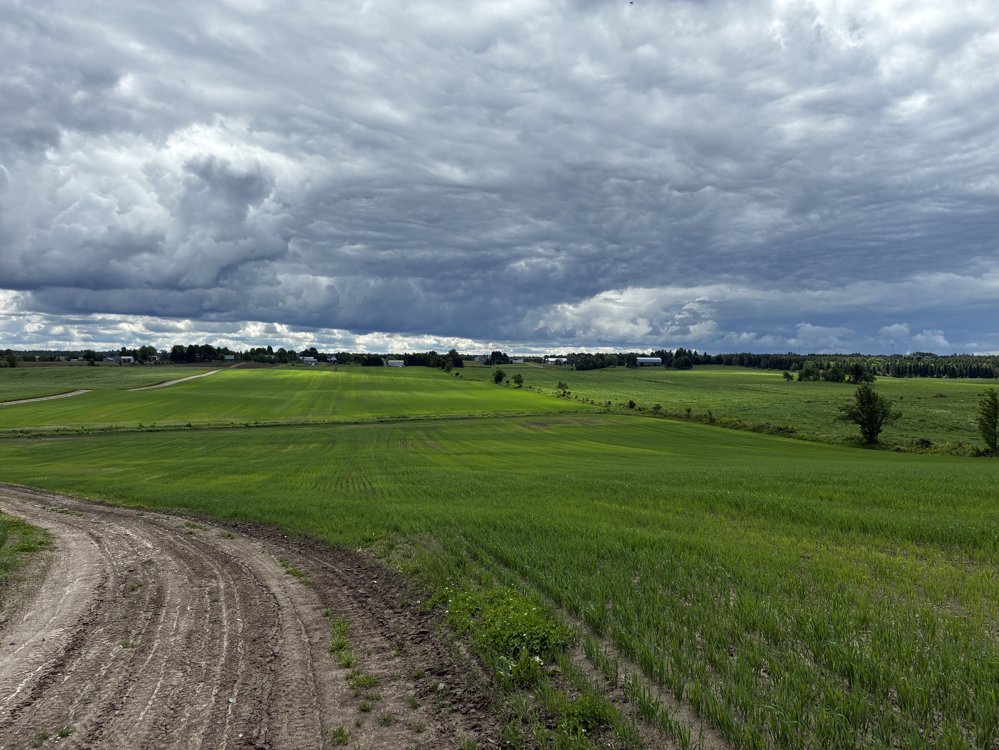

## Knowing a farm your whole life isn't the same as really knowing it

Taking over the family farm usually happens without the same checks that would come with buying from a stranger. The next generation grew up on this land, knows its quirks, its cropping habits, the stories passed down. That familiarity is reassuring, but it doesn't replace a few specific agronomic questions — especially when the last decade of operation wasn't documented the way an arm's-length transaction would be.

## What the recent years may have quietly changed

A parent who slowed down their pace of operation in the years leading up to a transfer may have, without meaning to, let certain parts of the field gradually decline — less frequent upkeep of the drainage network, a simplified rotation, liming pushed back. These gradual changes often go unnoticed within a family, precisely because no one is actively documenting them year over year.

## The real age of the drainage system

A subsurface drainage system installed decades earlier can be approaching the end of its useful life without the family having a clear sense of it, simply because no technical documentation was kept. Checking how old the existing drainage network actually is, and whether any drawdown work has already been needed, avoids inheriting a problem that simply wasn't visible as long as the operating pace stayed steady.

## Uses and rights that were never formalized

A family farm sometimes carries uses that settled in by habit rather than by any formal process — an access route, a secondary use, an informal arrangement with a neighbour. What seemed obvious within the family may not be formalized at all, and it's worth clarifying before a transfer, rather than simply carrying it forward on the strength of family memory.

## Asking the questions, even within the family

Asking these questions in a family context can feel unnecessary, even awkward. But it's actually the easiest moment to do it: the answers are still accessible, the person who knows the history is still around to provide them, and a well-documented transition protects the incoming generation just as much as the one handing the farm down. The same [questions worth asking before signing any farmland offer](../questions-avant-signer/index.qmd) apply just as much to a family transfer. On the financing side, [succession programs like FIRA and the CALA](../financement-releve-fira-lcpa/index.qmd) are also worth checking early in the process.

------------------------------------------------------------------------

*This content is general and informational — every property deserves an assessment suited to its own situation.*
