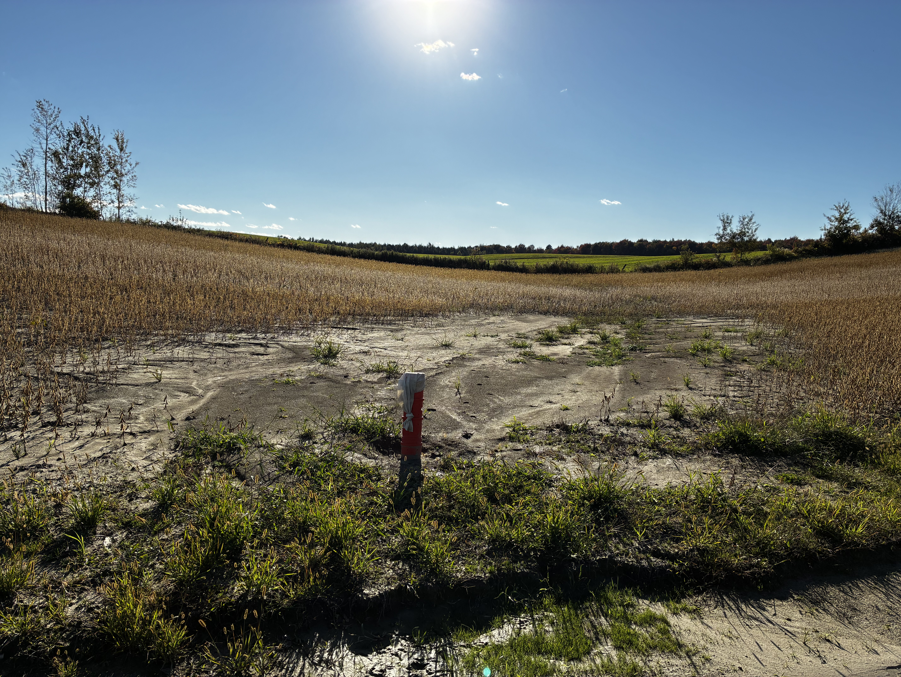

## What shows up before any soil test

A drainage problem doesn't always announce itself with an obvious flood. Most of the time, it shows up in small, easy-to-miss details, visible on a simple walk through the field — as long as you know where to look. Here are five signs that, taken together, often point to a more serious water problem than the field's general appearance suggests.

## 1. Patchy, uneven vegetation

A field that looks generally healthy but has patches where the crop grows shorter, yellower, or is missing altogether is almost always signaling an underperforming zone tied to excess water. These patches tend to follow the terrain: they show up in depressions, flat low spots, or footslopes, wherever water collects after rain instead of moving through.

## 2. Standing water or visible free water on the surface

Even several days after rain, a swale that still holds free water on the surface points to a slow drawdown rate — the soil is taking too long to move water that should normally be percolating or running off. A field in good condition typically drains within 24 to 48 hours; beyond that, the field's drainage network is worth questioning.

## 3. An anaerobic soil smell

Digging up a small clump of soil around 30 cm deep, a sulfur or rotten-egg smell is a classic sign of prolonged oxygen deprivation in the soil — soil that stays saturated too long develops anaerobic conditions that plant roots tolerate poorly. It's a simple test that requires nothing more than a shovel.

## 4. Grey or mottled soil at depth

A vertical soil cut that reveals a uniform grey tone, or rust-coloured mottling within the soil matrix, is a recognized pedological indicator of recurring seasonal waterlogging. It isn't the mark of a single wet year — it's a trace that builds up over several cycles.

## 5. Field access for seeding that's consistently delayed

If a parcel regularly takes longer to dry out in spring than neighbouring fields — equipment getting stuck, seeding running one to two weeks behind, year after year — that's an indirect but reliable sign of a slower-than-normal drawdown rate.

## One sign, a pattern, and a much clearer picture

Any single one of these signs could have a one-off explanation. Several of them, combined and repeated from one year to the next, paint a much clearer picture — often well before a formal soil test is ever ordered. That kind of pre-purchase read is especially useful for telling apart [farmed land and farmland potential](../terre-culture-vs-potentiel/index.qmd) priced exactly the same.

------------------------------------------------------------------------

*This content is general and informational — every property deserves an assessment suited to its own situation.*
